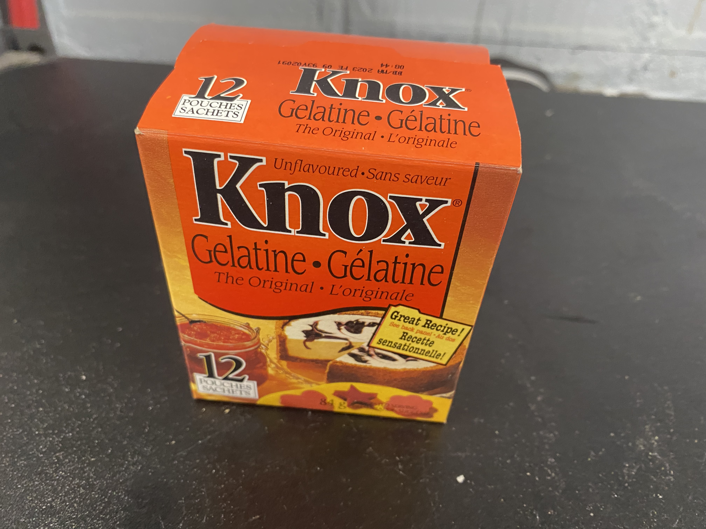
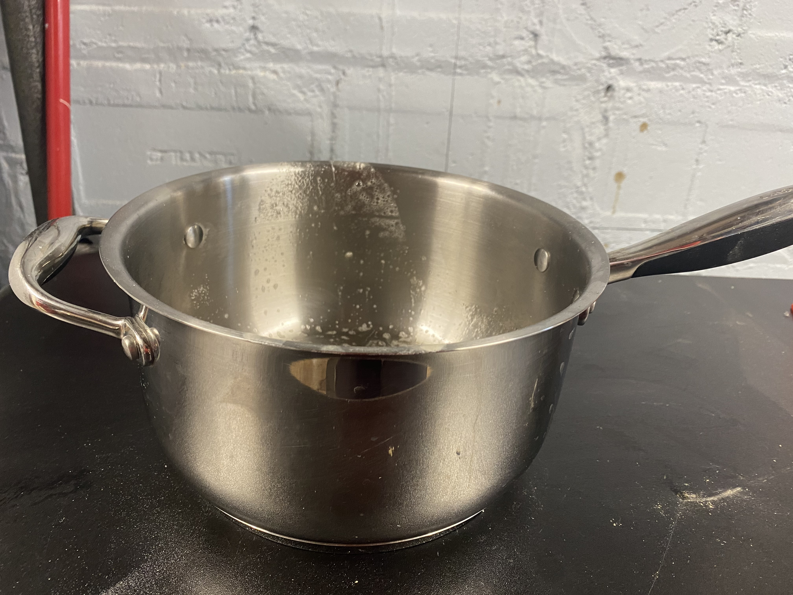
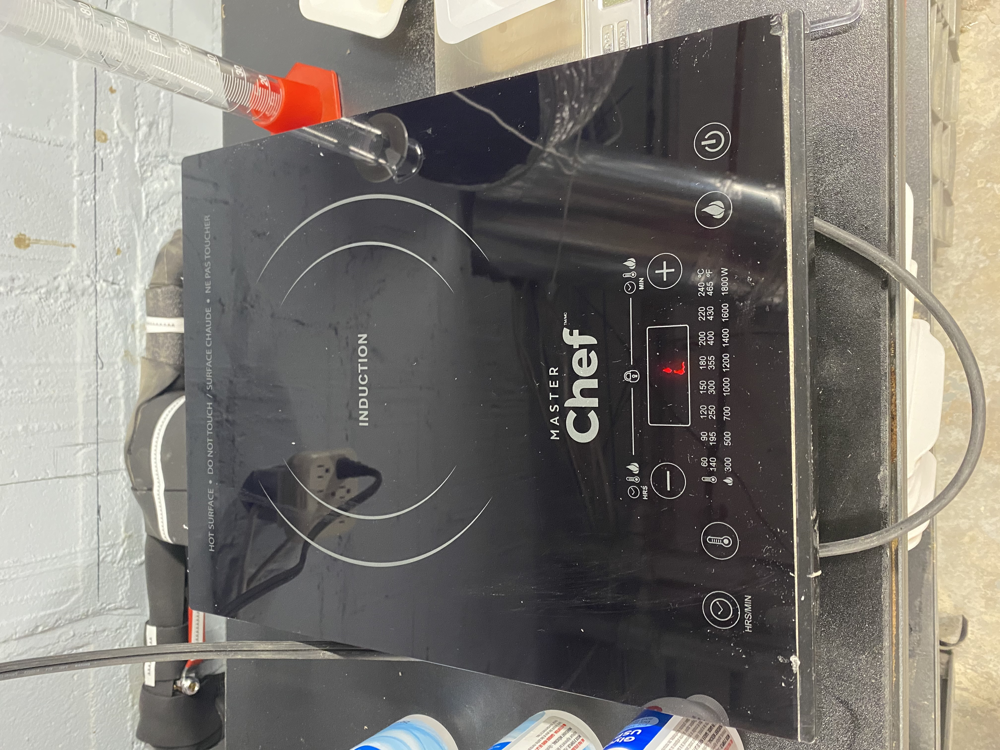
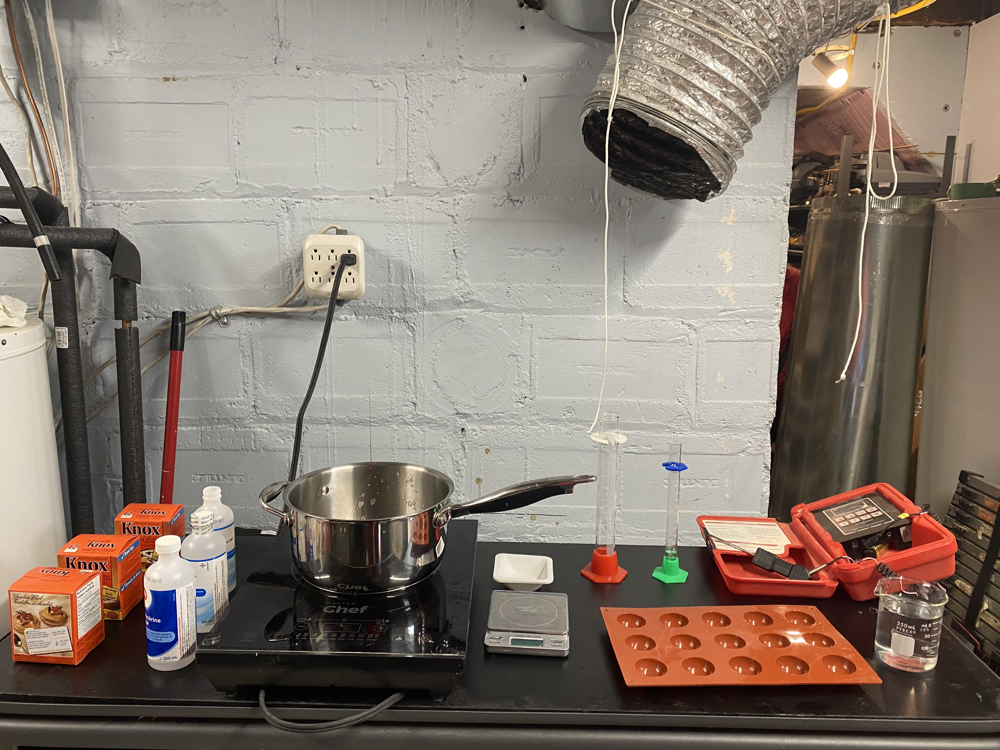

```{r setup, include=FALSE}
knitr::opts_chunk$set(echo = F, out.width = "6cm", fig.align = "center", fig.pos = "H")

decimalplaces <- function(x) {
    if (abs(x - round(x)) > .Machine$double.eps^0.5) {
        nchar(strsplit(sub('0+$', '', as.character(x)), ".", fixed = TRUE)[[1]][[2]])
    } else {
        return(0)
    }
}
```

# Introduction

A polymer is a large molecule composed of smaller building blocks, called monomers, linked together to form long chains \cite[p.~10]{Herdman1993} Polymers can be produced by artificial means, as is the case with **polyethylene** and **nylon**, among many others. These polymers, which are frequently referred to as plastics, can be molded or shaped by the application of heat or pressure. In addition, they also tend to have several other useful capabilities, such as a low density, a low electrical conductivity, transparency, and considerable toughness. \cite{Rodriguez2020} By virtue of these properties, man-made plastics have had a dramatic impact on the daily lives of many, and are a component in many products. \cite{Rodriguez2020, Herdman1993} As an example of their incredible versatility, plastics can be found in the composition of automobile interiors as well as many different types of clothing and beverage containers. \par

That said, such synthetic polymers have been subject of considerable criticism due to the fact that they are not biodegradable and are derived from nonrenewable resources. \cite[p.~2]{Herdman1993} In fact, the great strength and toughness of these plastics, a characteristic that is considered advantageous by the industry, causes them to persist in the environment and makes their disposal rather complex \cite[p.~2]{Herdman1993} Many synthetic plastics produce toxic byproducts upon their production and make use of toxic ingredients, making their production dangerous for natural life. \cite[p.~2]{Herdman1993} \par

Some historians consider that plastics began with the synthesis of Bakelite in 1907. \cite{Moore2020} Although this perhaps marked the beginning of the age of synthetic plastics, humans have made use of *natural* polymers for thousands of years. \cite[p.~1]{Herdman1993} Natural polymers, for instance, include DNA (deoxyribonucleic acid), a substance used by most organisms on planet Earth to transmit genetic information, and collagen. \cite[p.~7]{Herdman1993} In light of the many disadvantages of synthetic polymers, these natural polymers have been considered as a possible replacement by virtue of their ability to effectively naturally biodegrade. One such biopolymer is collagen \cite[p.~2]{Herdman1993}. \par

Collagen is a major structural protein of most connective tissues in mammals, such as skin, bones, and tendons. \cite{Ramachandran1963} Collagen-based plastic is already used in the production of drug-delivery devices (i.e. pill capsules), though its application in the context of other fields such as packaging has been criticized due to its structural weakness. Thus, this essay aims to determine whether an  an increase in the gelatin content of a sample of  bioplastic can offer a considerable increase in the mechanical strength of the sample. If this relationship is indeed true, gelatin bioplastics may have the potential to replace traditional plastics.

Research has already been conducted in the strength of gelatin bioplastic, such as \cite{Pal2007}. That said, this research used different gelatin samples with known triple-helix concentrations. The idea was to characterize the properties of these different samples. It was concluded that samples with a greater triple-helix content were stronger. That said, can the properties of greater triple-helix collagen be recreated by simply increasing the collagen concentration? 

# Investigation

## Safety Considerations

Gelatin is nontoxic and an FDA approved cooking ingredient. Unsurprisingly, water is also nontoxic and presumably FDA-approved. I made use of a fume hood simply because the fumes produced by the melting gelatin have a very bad smell, and I do not want this to hinder my concentration.\par

The hotplate is at a temperature of 90 degrees Celsius, which is, relatively speaking, not absurdly warm. It is, however, recommended to avoid touching the hotplate or the liquid as it is being heated

## General Materials

I have added some additional notes on the materials I used in this section.

### Knox Powder

There are several different types of gelatin, namely Type A and B \cite{Ramendra2014} It is difficult to tell exactly what type the gelatin I used, Knox gelatin, is made of. I have conducted this experiment under the assumption that the Knox gelatin I used is Type A pork gelatin. The reasoning behind this assumption is that Type A gelatin has been used in many experiments I have seen, namely, \cite{Bigi2004}. Type A gelatin is created via the acidic hydrolysis of pork skin and is considered to be rather elastic. \cite{Ramendra2014} Fortunately, however, the actual mammal that was used to create the gelatin is of little concern, as the composition of mammalian collagen is very nearly the same for all species. \cite[p.~129]{Ramachandran1963}.

The powder I used was Knox gelatin, as shown in Figure \ref{fig:gel-powder} available online at <https://www.iga.net/en/product/gelatineunflavoured-12-pk/00000_000000005835486023>.

```{r gel-powder, fig.cap="Gelatine Powder"}

```

### Metal Pot

The metal pot I used was the 2 \si{L} Lagostina Impact Capsule D757.6239.11 from the set available online at <https://www.lagostina.ca/en/Cookware/Cookware-Sets/Stainless-Steel-12-Piece-Cookware-Set-/p/9100050108>, as shown in Figure \ref{fig:metal-pot}.

```{r metal-pot, fig.cap="Metal Pot"}

```

### Hot Plate

The hot plate I used was the Master Chef induction plate, as shown in Figure \ref{fig:hot-plate}.

```{r hot-plate, fig.cap="Hot Plate"}

```

### Stirring Spoon

I used a regular spoon to stir the mixture, as I did not have a glass stirring rod at my disposal.

## Prior Experimentation

## Creating the Samples

After having completed some preliminary research, as outlined in Section \ref{prior-experimentation}, the first step to this experiment was the creation of the samples to be tested, as outlined in Section \ref{testing-the-samples}. Note that for Section \ref{prior-experimentation}, Section \ref{creating-the-samples}, and Section \ref{testing-the-samples}, the same setup was used, as shown in Figure \ref{fig:experiment-setup}. That said, some materials were used for some trials and not used for others.

``` {r experiment-setup, fig.cap="Setup of the Workstation"}

```

### Materials

1. Beaker (200 mL)
1. Graduated Cylinder (100 mL)
1. Graduated Cylinder (25 mL)
1. Electronic Scale (precision of \(\pm\) 0.01 \si{g})
1. Knox gelatin (see Section \ref{knox-powder})
1. Tap water
1. Hot plate (see Section \ref{hot-plate})
1. Metal pot (see Section \ref{metal-pot})
1. Stirring spoon (see Section \ref{stirring-spoon})
1. A set of equal-sized molds
1. An electronic thermometer
1. Fume Hood (as mentioned in Section \ref{safety-considerations})

### Procedure

1. Make sure the hot plate is OFF.
1. Place the pot on top of the hot plate.
1. Pour the correct amount of water into the pot (see Table \ref{tab:ingredients}).
1. Pour the correct amount of gelatin into the pot (see Table \ref{tab:ingredients}).
1. Stir with the stirring spoon until the gelatin becomes dissolved into the water.
1. Set the hot plate ON to 500 W (90 degrees Celsius)
1. Stir for 1 minute. The mixture should be completely liquid, and contain no solid matter.
1. Pour the mixture into a mold.
1. Await 12 hours for the sample to dry.
1. There should be extra gelatin samples to complete multiple trials for each sample. Repeat the procedure for all different samples.

``` {r ingredients}
library(kableExtra)
read.csv("./ingredients.csv") %>%
  kbl(booktabs = T, position = "H", caption = "Ingredients for each Sample", col.names = c("Sample","Volume of Water (mL)","Mass of Gelatin (g)"), align = c("c","c","c")) %>%
    kable_styling(latex_options = c("striped","scale_down"))
```

## Testing the Samples

### Methodology

Some experiments, such as \cite{Pal2007}, make use of a tensile testing machine, such as the H10KS tensile testing machine, in order to determine the tensile strength of their samples. A tensile testing machine is a motorized device capable of pulling a sample apart and measuring the amount of force required to rupture it. Unfortunately, such a device was not at my disposal and as a result, it was necessary for me to find an alternative method to determine the strength of my samples.\par

The key to indirectly determining their tensile strength lies in the chemical structure of the samples themselves. As discussed in Section , gelatin is produced from collagen. Collagen is itself a polymer composed of a triple-helix structure of many different molecules. As collagen is heated up, the triple-helix structure is broken down into random coils to give gelatin. \cite{Bigi2004} A hydrogel is a liquid that solidifies into a bioplastic film when introduced to the appropriate mold. Gelling is the process of mixing gelatin with water and subsequently heating this mixture in order to create the hydrogel. During gelling, the random coils inside of the gelatin partially regenerate the triple-helix structure originally found in the gelatin. \cite{Bigi2004} Considerable research suggests that the greater the triple-helix content, the higher the strength of the film and the lower the swelling property in water. \cite{Pal2007, Bigi2004} Presumably, an increased amount of gelatin concentration within the hydrogel suggests that there will be a greater triple-helix content. It is for this reason that the weight gain of the samples after being exposed to water was measured in this experiment.

### Materials

### Procedure

# Analysis

## Processing Data

The formula used to calculate the amount of absorbed water is Equation \eqref{eqn:w}, where \(W_w\) is the weight of the wet sample and \(W-d\) is the weight of the dry sample.

\begin{equation}
  W(\%) = 100\cdot\frac{W_w - W_d}{W_d} \label{eqn:w}
\end{equation}

The formula was taken from \cite[p.~5676]{Bigi2004}. It is essentially the percentage increase in weight of the sample.

## Results

``` {r echo = FALSE}
library(kableExtra)
data <- read.csv("./results.csv")
absorbed_water <- rep(NA,nrow(data))
error <- rep(NA,nrow(data))
for (i in 1:nrow(data)) {
  # Calculate absorbed Water
  wd <- data[i,2]
  ww <- data[i,3]
  aw <- (((ww - wd)/wd) * 100)
  # Calculate Error
  wd_error <- data[i,4]
  ww_error <- data[i,5]
  num_error <- wd_error + ww_error
  num_rel <- (num_error / (ww-wd))
  den_rel <- (wd_error / (wd))
  final_err <- num_rel + den_rel
  error[i] <- signif(final_err, 1)
  # Enter Absorbed Water with Rounding
  absorbed_water[i] <- round(aw,decimalplaces(error[i]))
  
}
data.frame(sample = data[,1], absorbed_water = absorbed_water, error = error) %>%
  kbl(booktabs = T, col.names = c('Sample','Amount of Absorbed Water','Error'), caption = "Results", align = c("c","c","c"), position = "H") %>%
    kable_styling(latex_options = c("striped","scale_down"))
```

# Extra

Experimental evidence suggests that there is a correlation between the mechanical strength of gelatin film and this concentration of triple-helices in the hydrogel. The more triple-helices inside of the hydrogel, the stronger the gelatin film will be, and the less it will swell when exposed to water. \cite{Bigi2004}

The amount of triple-helices present in the hydrogel depends on the nature of the gelatin that was used in the creation of the plastic sample. \cite{Bigi2004} This depe